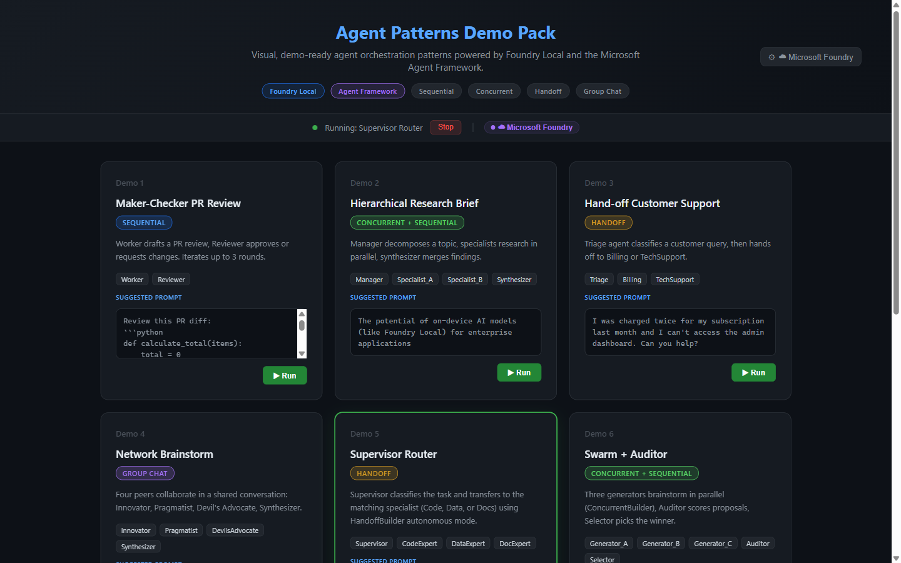
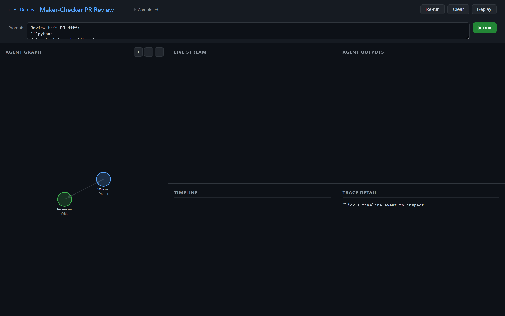
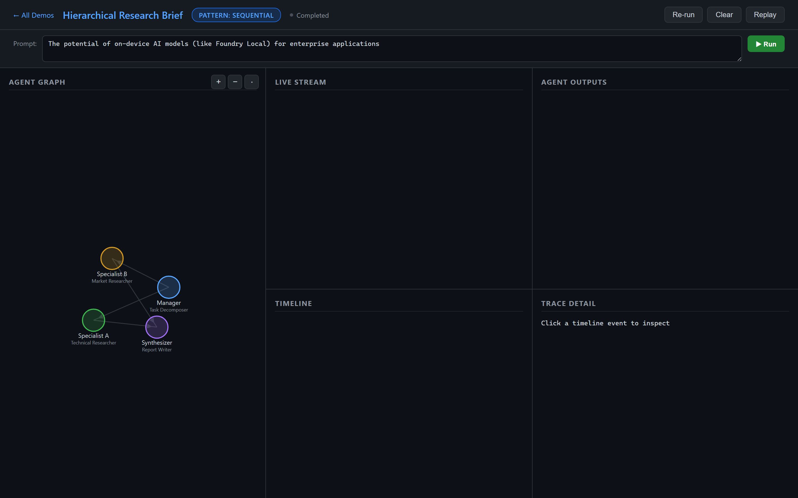
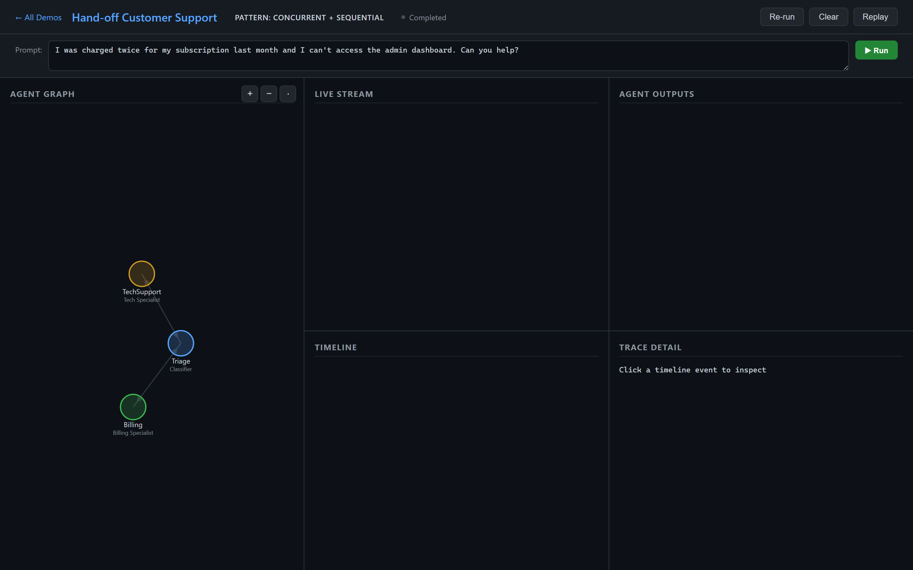
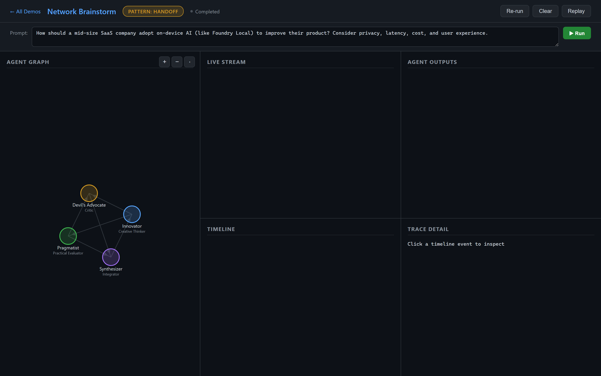
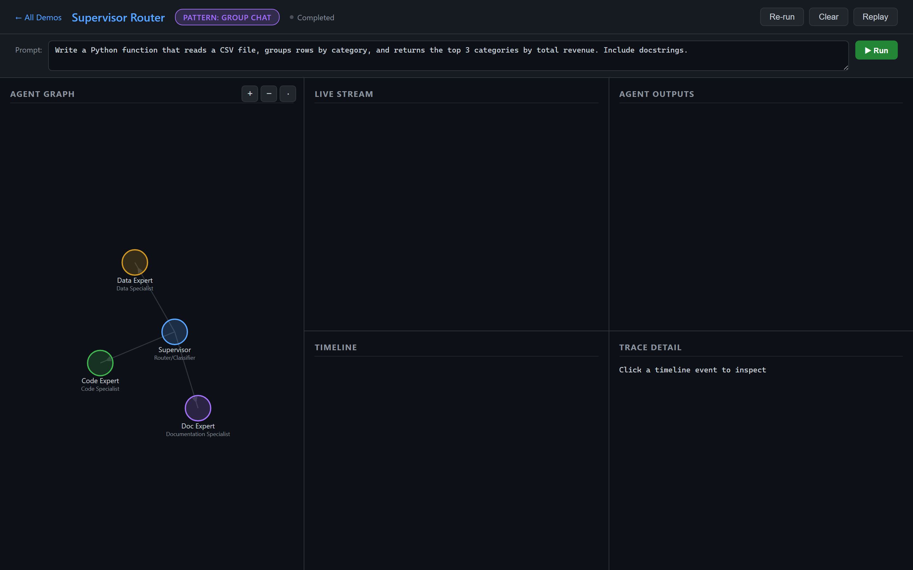
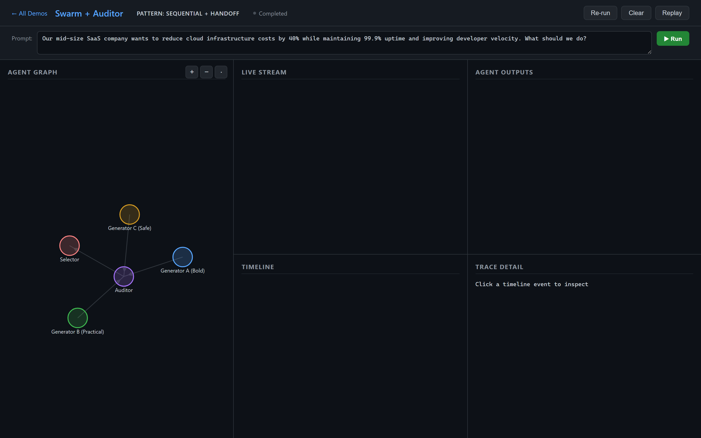
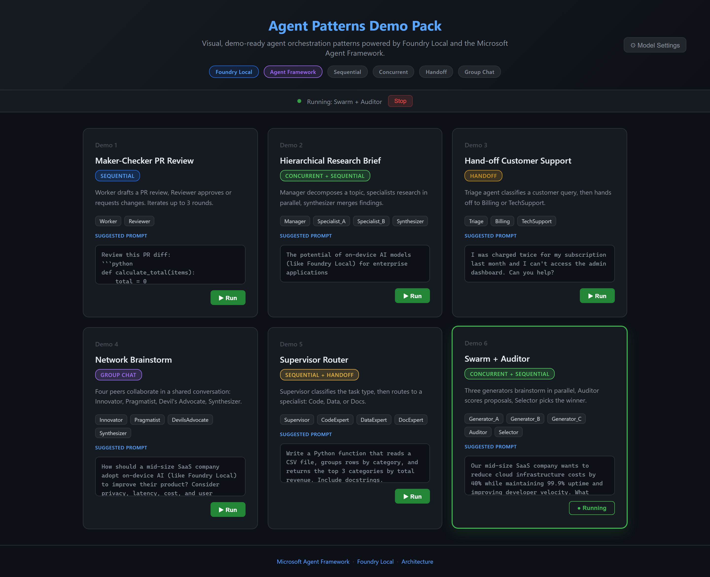

# Agent Patterns Demo Pack

**Visual, demo-ready multi-agent interaction patterns using Foundry Local + Microsoft Agent Framework**

> Run multi-agent orchestrations **entirely on-device** with animated graph visualizations, live message tracing, and replay capabilities.


---

## Quick Start

```bash
# 1. Install Foundry Local (see https://foundrylocal.ai)
winget install Microsoft.FoundryLocal        # Windows
# brew install foundrylocal                  # macOS (when available)

# 2. Pull and start a model
foundry model run qwen2.5-1.5b                 # small, fast model

# 3. Clone & install
cd agentpatterns
python -m venv .venv
.venv\Scripts\activate                       # Windows
# source .venv/bin/activate                  # macOS/Linux
pip install -r requirements.txt

# 4. Launch the web app (all demos in one UI)
python app.py
# Open http://localhost:8765 — pick any demo from the launcher
```

### Web App Launcher

The fastest way to explore all six demos is through the unified web app:

```bash
python app.py
```

Open **http://localhost:8765** in your browser. You'll see a card-based launcher
showing all demos with their orchestration patterns and agents. Click any card
to start that demo and open its live dashboard (graph, timeline, stream panels).

Use **← All Demos** in the dashboard header to switch between demos, or **Re-run**
to restart the current one.

### Run a Single Demo

You can also run any demo standalone:

```bash
python -m demos.maker_checker.run
python -m demos.hierarchical_research.run
python -m demos.handoff_support.run
python -m demos.network_brainstorm.run
python -m demos.supervisor_router.run
python -m demos.swarm_auditor.run
# Each opens http://localhost:8765 with the agent graph animation
```

---

## Demos

| # | Demo | Pattern | Agents | Architecture |
|---|------|---------|--------|-------------|
| 1 | [Maker–Checker PR Review](demos/maker_checker/) | Sequential | 2 (Worker + Reviewer) | Maker–Checker |
| 2 | [Hierarchical Research Brief](demos/hierarchical_research/) | Concurrent | 4 (Manager + 2 Specialists + Synthesizer) | Hierarchical |
| 3 | [Hand-off Customer Support](demos/handoff_support/) | Handoff | 3 (Triage + Billing + Tech) | Hand-off |
| 4 | [Network Brainstorm](demos/network_brainstorm/) | Group Chat | 4 peers | Network/Peer |
| 5 | [Supervisor Router](demos/supervisor_router/) | Sequential + Handoff | 4 (Supervisor + 3 Specialists) | Supervisor |
| 6 | [Swarm + Auditor](demos/swarm_auditor/) | Concurrent + Sequential | 5 (3 Generators + Auditor + Selector) | Custom |

### Pick a demo → run → watch the agent graph animate

Each demo launches a **web UI** at `http://localhost:8765` with:

- **Graph Panel**: nodes are agents, edges are interaction routes; active agent highlighted
- **Live Stream**: real-time messages as agents communicate
- **Timeline**: chronological trace with expandable event details
- **Replay**: load any saved run (JSONL) and replay the animation

---

## Architecture

```
agentpatterns/
├── app.py                          # Unified web launcher (start here)
├── capture_screenshots.py          # Playwright E2E screenshot & video capture
├── validate_demos.py               # Shim → tests/test_demos.py
├── requirements.txt
├── .env.example
├── shared/
│   ├── runtime/
│   │   ├── foundry_client.py       # Foundry Local client (foundry-local-sdk)
│   │   ├── model_config.py         # Runtime-switchable provider config singleton
│   │   ├── agent_wrapper.py        # Instrumented agent wrapper emitting trace events
│   │   └── orchestrations.py       # Pattern helpers using AF orchestration builders
│   ├── events/
│   │   ├── event_types.py          # agent_started, agent_message, handoff, etc.
│   │   └── event_bus.py            # In-process pub/sub + WebSocket bridge + JSONL log
│   └── ui/
│       ├── server.py               # FastAPI + WebSocket server
│       └── static/
│           ├── launcher.html       # Demo launcher home page
│           ├── dashboard.html      # Per-demo live dashboard
│           ├── graph.js            # D3.js force-directed graph with zoom
│           ├── dashboard.js        # Dashboard event handling
│           ├── timeline.js         # Timeline + trace inspector
│           ├── stream.js           # Live message stream
│           └── styles.css          # Styling
├── demos/
│   ├── maker_checker/              # Demo 1 — Sequential
│   ├── hierarchical_research/      # Demo 2 — Concurrent + Sequential
│   ├── handoff_support/            # Demo 3 — Handoff
│   ├── network_brainstorm/         # Demo 4 — Group Chat
│   ├── supervisor_router/          # Demo 5 — Sequential + Handoff
│   └── swarm_auditor/              # Demo 6 — Concurrent + Sequential
├── tests/
│   ├── test_demos.py               # E2E demo validation (all 6)
│   ├── test_topology.py            # Unit tests — topology.json structure
│   ├── test_event_bus.py           # Unit tests — EventBus
│   └── test_model_config.py        # Unit tests — ModelConfig
└── docs/
    ├── architecture.md
    ├── demo-day-checklist.md
    └── walkthrough.md
```

---

## Tech Stack

| Component | Technology |
|-----------|-----------|
| **Model Runtime** | [Foundry Local](https://foundrylocal.ai): on-device, OpenAI-compatible |
| **Orchestration** | [Microsoft Agent Framework](https://github.com/microsoft/agent-framework) — Sequential, Concurrent, Handoff, Group Chat, Magentic |
| **Agent SDK** | `agent-framework`, `agent-framework-orchestrations`, `agent-framework-foundry-local` |
| **UI Backend** | FastAPI + WebSocket |
| **Visualization** | D3.js (force-directed graph), vanilla JS (timeline/stream) |

---

## Foundry Local Setup

1. **Install**: Visit [foundrylocal.ai](https://foundrylocal.ai) or use:
   ```bash
   winget install Microsoft.FoundryLocal
   ```
2. **List available models**:
   ```bash
   foundry model list
   ```
3. **Run a model** (starts the local service automatically):
   ```bash
   foundry model run phi-4-mini
   ```
4. **Check service status** (Foundry Local uses a dynamic port):
   ```bash
   foundry service status
   ```
   This returns the actual URL (e.g. `http://localhost:47372`). The demos auto-detect this via the [foundry-local-sdk](https://github.com/microsoft/Foundry-Local).

> **Note:** Foundry Local starts on a **dynamic port** — do not hardcode `5273`. The shared runtime uses `FoundryLocalManager` from the `foundry-local-sdk` to discover the correct endpoint automatically.

---

## Environment Configuration

Copy `.env.example` to `.env` and adjust if needed:

```bash
cp .env.example .env
```

| Variable | Default | Description |
|----------|---------|-------------|
| `MODEL_PROVIDER` | `foundry_local` | `foundry_local` or `azure_foundry` |
| `FOUNDRY_LOCAL_ENDPOINT` | *(auto-detected via SDK)* | Override local endpoint if needed |
| `FOUNDRY_MODEL` | `qwen2.5-1.5b` | Local model alias |
| `AZURE_FOUNDRY_ENDPOINT` | — | Microsoft Foundry endpoint URL |
| `AZURE_FOUNDRY_API_KEY` | — | Microsoft Foundry API key |
| `AZURE_FOUNDRY_MODEL` | `gpt-4o-mini` | Azure model name |
| `AZURE_FOUNDRY_DEPLOYMENT` | — | Azure deployment name |
| `UI_PORT` | `8765` | Web UI port |

---

## Testing

```bash
# Unit tests (topology, EventBus, ModelConfig) — no live service needed
python -m pytest tests/test_topology.py tests/test_event_bus.py tests/test_model_config.py -v

# E2E demo validation — requires Foundry Local running with a model loaded
python tests/test_demos.py

# All tests
python -m pytest tests/ -v
```

> `validate_demos.py` in the project root is a backwards-compatible shim that forwards to `tests/test_demos.py`.

---

## Reference Links

- [Foundry Local Homepage](https://www.foundrylocal.ai/)
- [Foundry Local Documentation](https://learn.microsoft.com/en-us/azure/ai-foundry/foundry-local/?view=foundry-classic)
- [Foundry Local SDK Reference](https://learn.microsoft.com/en-us/azure/ai-foundry/foundry-local/reference/reference-sdk?view=foundry-classic)
- [foundry-local-sdk (PyPI)](https://pypi.org/project/foundry-local-sdk/)
- [Foundry Local GitHub](https://github.com/microsoft/Foundry-Local)
- [Microsoft Agent Framework GitHub](https://github.com/microsoft/agent-framework)
- [Agent Framework Orchestration Patterns](https://learn.microsoft.com/en-us/agent-framework/workflows/orchestrations/)
- [Foundry Local Workshop (Community)](https://github.com/cassiebreviu/foundry-local-workshop/)

---

## Screenshots

### Launcher

| Home | Demo Cards (hover) |
|------|--------------------|
|  |  |

### Demo Dashboards

| Demo 1: Maker-Checker | Demo 2: Hierarchical Research |
|------------------------|--------------------------------|
|  |  |

| Demo 3: Hand-off Support | Demo 4: Network Brainstorm |
|--------------------------|----------------------------|
|  |  |

| Demo 5: Supervisor Router | Demo 6: Swarm + Auditor |
|---------------------------|-------------------------|
|  |  |

### Live Status



Regenerate screenshots and a walkthrough video with:

```bash
python capture_screenshots.py --video
# Outputs to screenshots/ and screenshots/video/demo_walkthrough.mp4
```

---

## License

MIT

> **Note**: This project is designed for local development and demos. The web server has no authentication and should only be run on localhost. See [SECURITY.md](SECURITY.md) for details.
