# Agent Patterns Demo Pack

**Visual, demo-ready multi-agent interaction patterns using Foundry Local + Microsoft Agent Framework**

> Run multi-agent orchestrations **entirely on-device** with animated graph visualizations, live message tracing, and replay capabilities.


---

## Overview

This demo pack contains **seven runnable multi-agent orchestration patterns** — Sequential, Concurrent, Handoff, Group Chat, Supervisor Router, Swarm + Auditor, and Magentic One — each with a live web dashboard that animates the agent graph, streams messages in real time, and logs every event for replay. It provides full coverage of every pattern in [Microsoft Agent Framework](https://github.com/microsoft/agent-framework): `SequentialBuilder`, `ConcurrentBuilder`, `HandoffBuilder`, `GroupChatBuilder`, and `MagenticBuilder`. It runs entirely on your laptop using [Foundry Local](https://foundrylocal.ai) (no API keys, no cloud costs), or you can switch to [Microsoft Foundry](https://ai.azure.com/) for cloud-hosted models deployed via the **model-router** with a single `.env` change. The pack is designed to help developers *see* how agents collaborate so they can apply the right pattern in their own projects.

---

## Quick Start

### Prerequisites

- **Python 3.10 or later** — check your version with `python --version`. Download from [python.org](https://www.python.org/downloads/) if needed.
- **Git** — to clone this repo. Download from [git-scm.com](https://git-scm.com/) if needed.

---

### Step 1 — Set up your model provider

Choose **one** of the options below. You can switch between them at any time from the UI settings panel.

---

#### Option A — Foundry Local (on-device, no API key needed)

Foundry Local runs AI models entirely on your device — no internet connection required during inference.

**Windows (PowerShell or Command Prompt):**
```bash
winget install Microsoft.FoundryLocal
```

**macOS:** Support coming soon — check [foundrylocal.ai](https://foundrylocal.ai) for updates.

---

#### Option B — Microsoft Foundry (cloud, model-router)

[Microsoft Foundry](https://ai.azure.com/) lets you deploy and route to cloud-hosted models via a single **model-router** endpoint.

1. Sign in at [ai.azure.com](https://ai.azure.com/)
2. Create or select a **project**
3. In the left sidebar, go to **My assets → Models + endpoints**
4. Click **+ Deploy model** and select your model choose **Model-Router** — this creates a smart routing endpoint that can balance across multiple model deployments
6. Complete the deployment wizard; note the **Target URI** and **API key** from the deployment detail page
7. Add them to your `.env` file see the .env.example:

```

> **What is model-router?** The model-router in Microsoft Foundry is a managed deployment type that intelligently routes requests across multiple model deployments based on availability, latency, and quota — giving you a single stable endpoint even as you add or swap underlying models.

---

### Step 2 — Start a model *(Foundry Local — Option A only)*

If you chose **Option B (Microsoft Foundry)**, skip this step — your model is already running in the cloud.

```bash
foundry model run qwen2.5-1.5b
```

This downloads (first run only) and starts the `qwen2.5-1.5b` model — a small, fast model well-suited for demos. Leave this terminal open.

> **Tip:** Run `foundry model list` to see all available models.

---

### Step 3 — Clone the repository

```bash
git clone https://github.com/your-org/agent-patterns-foundry-demo.git
cd agent-patterns-foundry-demo
```

---

### Step 4 — Create a virtual environment

A **virtual environment** keeps this project's Python packages separate from everything else on your system. This is a best practice that avoids version conflicts.

**Windows (PowerShell):**
```powershell
python -m venv .venv
.venv\Scripts\Activate.ps1
```

**Windows (Command Prompt):**
```cmd
python -m venv .venv
.venv\Scripts\activate.bat
```

**macOS / Linux:**
```bash
python3 -m venv .venv
source .venv/bin/activate
```

Once activated, your terminal prompt will show `(.venv)` at the start — this confirms the virtual environment is active.

> **Troubleshooting (Windows PowerShell):** If you see an error about script execution being disabled, run:
> ```powershell
> Set-ExecutionPolicy -ExecutionPolicy RemoteSigned -Scope CurrentUser
> ```
> Then try activating again.

---

### Step 5 — Install dependencies

With the virtual environment active, install all required packages:

```bash
pip install -r requirements.txt
```

This installs the Microsoft Agent Framework, Foundry Local SDK, FastAPI, and all other dependencies. It typically takes 1–2 minutes.

> **Verify the install:** Run `pip list` to see all installed packages.

---

### Step 6 — Launch the web app

```bash
python app.py
```

Open **http://localhost:8765** in your browser — you'll see the demo launcher. Pick any demo card to start it.

> **Note:** If you chose Option A (Foundry Local), make sure it is still running (from Step 2) before launching. If you chose Option B (Microsoft Foundry), ensure your `.env` has the endpoint and API key set.

### Web App Launcher

The fastest way to explore all seven demos is through the unified web app:

```bash
python app.py
```

Open **http://localhost:8765** in your browser. You'll see a card-based launcher
showing all demos with their orchestration patterns and agents. Click any card
to start that demo and open its live dashboard (graph, timeline, stream panels).

Use **← All Demos** in the dashboard header to switch between demos, or **Re-run**
to restart the current one.

### Run a Single Demo

You can also run any demo standalone:

```bash
python -m demos.maker_checker.run
python -m demos.hierarchical_research.run
python -m demos.handoff_support.run
python -m demos.network_brainstorm.run
python -m demos.supervisor_router.run
python -m demos.swarm_auditor.run
python -m demos.magentic_one.run
# Each opens http://localhost:8765 with the agent graph animation
```

---

## Demos

### Pattern coverage

All five Agent Framework orchestration builders are covered:

| AF Pattern | Framework Builder | Demo(s) |
|---|---|---|
| Sequential | `SequentialBuilder` | [Maker–Checker PR Review](demos/maker_checker/) |
| Concurrent | `ConcurrentBuilder` | [Hierarchical Research Brief](demos/hierarchical_research/), [Swarm + Auditor](demos/swarm_auditor/) |
| Handoff | `HandoffBuilder` | [Hand-off Customer Support](demos/handoff_support/), [Supervisor Router](demos/supervisor_router/) |
| Group Chat | `GroupChatBuilder` | [Network Brainstorm](demos/network_brainstorm/) |
| Magentic One | `MagenticBuilder` | [Magentic One Assessment](demos/magentic_one/) |

### All demos

| # | Demo | AF Builder | Agents | Pattern |
|---|------|-----------|--------|---------|
| 1 | [Maker–Checker PR Review](demos/maker_checker/) | `SequentialBuilder` | 2 (Worker + Reviewer) | Sequential — iterative review loop, up to 3 rounds |
| 2 | [Hierarchical Research Brief](demos/hierarchical_research/) | `ConcurrentBuilder` | 4 (Manager + 2 Specialists + Synthesizer) | Concurrent specialists → sequential synthesizer |
| 3 | [Hand-off Customer Support](demos/handoff_support/) | `HandoffBuilder` | 3 (Triage + Billing + Tech) | Handoff — autonomous mode with termination condition |
| 4 | [Network Brainstorm](demos/network_brainstorm/) | `GroupChatBuilder` | 4 peers | Group Chat — round-robin, 4 max rounds |
| 5 | [Supervisor Router](demos/supervisor_router/) | `HandoffBuilder` | 4 (Supervisor + 3 Specialists) | Handoff — Supervisor transfers to matching specialist |
| 6 | [Swarm + Auditor](demos/swarm_auditor/) | `ConcurrentBuilder` | 5 (3 Generators + Auditor + Selector) | Concurrent generators → sequential audit + selection |
| 7 | [Magentic One Assessment](demos/magentic_one/) | `MagenticBuilder` | 4 (MagenticManager + Researcher + Strategist + Critic) | Magentic One — manager routes dynamically, not round-robin |

### Pick a demo → run → watch the agent graph animate

Each demo launches a **web UI** at `http://localhost:8765` with:

- **Graph Panel**: nodes are agents, edges are interaction routes; active agent highlighted
- **Live Stream**: real-time messages as agents communicate
- **Timeline**: chronological trace with expandable event details
- **Replay**: load any saved run (JSONL) and replay the animation

---

## Architecture

```
agentpatterns/
├── app.py                          # Unified web launcher (start here)
├── capture_screenshots.py          # Playwright E2E screenshot & video capture
├── validate_demos.py               # Shim → tests/test_demos.py
├── requirements.txt
├── .env.example
├── shared/
│   ├── runtime/
│   │   ├── foundry_client.py       # Foundry Local client (foundry-local-sdk)
│   │   ├── model_config.py         # Runtime-switchable provider config singleton
│   │   ├── agent_wrapper.py        # Instrumented agent wrapper emitting trace events
│   │   └── orchestrations.py       # Pattern helpers using AF orchestration builders
│   ├── events/
│   │   ├── event_types.py          # agent_started, agent_message, handoff, etc.
│   │   └── event_bus.py            # In-process pub/sub + WebSocket bridge + JSONL log
│   └── ui/
│       ├── server.py               # FastAPI + WebSocket server
│       └── static/
│           ├── launcher.html       # Demo launcher home page
│           ├── dashboard.html      # Per-demo live dashboard
│           ├── graph.js            # D3.js force-directed graph with zoom
│           ├── dashboard.js        # Dashboard event handling
│           ├── timeline.js         # Timeline + trace inspector
│           ├── stream.js           # Live message stream
│           └── styles.css          # Styling
├── demos/
│   ├── maker_checker/              # Demo 1 — Sequential (SequentialBuilder)
│   ├── hierarchical_research/      # Demo 2 — Concurrent (ConcurrentBuilder)
│   ├── handoff_support/            # Demo 3 — Handoff (HandoffBuilder)
│   ├── network_brainstorm/         # Demo 4 — Group Chat (GroupChatBuilder)
│   ├── supervisor_router/          # Demo 5 — Handoff (HandoffBuilder)
│   ├── swarm_auditor/              # Demo 6 — Concurrent (ConcurrentBuilder)
│   └── magentic_one/               # Demo 7 — Magentic One (MagenticBuilder)
├── tests/
│   ├── test_demos.py               # E2E demo validation (all 7)
│   ├── test_topology.py            # Unit tests — topology.json structure
│   ├── test_event_bus.py           # Unit tests — EventBus
│   └── test_model_config.py        # Unit tests — ModelConfig
└── docs/
    ├── architecture.md
    ├── demo-day-checklist.md
    └── walkthrough.md
```

---

## Tech Stack

| Component | Technology |
|-----------|-----------|
| **Model Runtime** | [Foundry Local](https://foundrylocal.ai): on-device, OpenAI-compatible |
| **Cloud Runtime** | [Microsoft Foundry](https://ai.azure.com/): model-router deployment — swap to cloud with a single `.env` change |
| **Orchestration** | [Microsoft Agent Framework](https://github.com/microsoft/agent-framework) — all five builders covered: `SequentialBuilder`, `ConcurrentBuilder`, `HandoffBuilder`, `GroupChatBuilder`, `MagenticBuilder` |
| **Agent SDK** | `agent-framework`, `agent-framework-orchestrations`, `agent-framework-foundry-local` |
| **UI Backend** | FastAPI + WebSocket |
| **Visualization** | D3.js (force-directed graph), vanilla JS (timeline/stream) |

---

## Foundry Local Setup

1. **Install**: Visit [foundrylocal.ai](https://foundrylocal.ai) or use:
   ```bash
   winget install Microsoft.FoundryLocal
   ```
2. **List available models**:
   ```bash
   foundry model list
   ```
3. **Run a model** (starts the local service automatically):
   ```bash
   foundry model run phi-4-mini
   ```
4. **Check service status** (Foundry Local uses a dynamic port):
   ```bash
   foundry service status
   ```
   This returns the actual URL (e.g. `http://localhost:47372`). The demos auto-detect this via the [foundry-local-sdk](https://github.com/microsoft/Foundry-Local).

> **Note:** Foundry Local starts on a **dynamic port** — do not hardcode `5273`. The shared runtime uses `FoundryLocalManager` from the `foundry-local-sdk` to discover the correct endpoint automatically.

---

## Microsoft Foundry (Cloud)

[Microsoft Foundry](https://ai.azure.com/) provides cloud-hosted models via the **model-router** — a single managed endpoint that routes requests across your deployed models.

### Deploy a model via model-router

1. Sign in at [ai.azure.com](https://ai.azure.com/)
2. Open your project (or create one: **+ New project**)
3. Go to **My assets → Models + endpoints → + Deploy model**
4. Choose your model (e.g. `gpt-4o-mini`, `Phi-4`, `Mistral-Large`)
5. Set **Deployment type** to **Model router**
6. Finish the wizard; on the deployment detail page copy:
   - **Target URI** — the model-router endpoint
   - **Key** — your API key

### Configure `.env`

```bash
MODEL_PROVIDER=azure_foundry
AZURE_FOUNDRY_ENDPOINT=https://<your-project>.services.ai.azure.com/models
AZURE_FOUNDRY_API_KEY=<your-api-key>
AZURE_FOUNDRY_MODEL=gpt-4o-mini
# Optional: pin to a specific deployment name
# AZURE_FOUNDRY_DEPLOYMENT=my-gpt4o-deployment
```

Restart `python app.py` and all demos will route through Microsoft Foundry. No code changes needed — the `ModelConfig` singleton reads from `.env` at startup. You can also switch providers live from the **Model Settings** panel in the launcher UI (click the ⚙ gear icon or the provider chip in the header).

> **Tip:** The model-router endpoint (`/models`) is compatible with the OpenAI Python SDK and the Microsoft Agent Framework without any additional changes.

---

## Environment Configuration

Copy `.env.example` to `.env` and adjust if needed:

```bash
cp .env.example .env
```

| Variable | Default | Description |
|----------|---------|-------------|
| `MODEL_PROVIDER` | `foundry_local` | `foundry_local` or `azure_foundry` |
| `FOUNDRY_LOCAL_ENDPOINT` | *(auto-detected via SDK)* | Override local endpoint if needed |
| `FOUNDRY_MODEL` | `qwen2.5-1.5b` | Local model alias |
| `AZURE_FOUNDRY_ENDPOINT` | — | Microsoft Foundry endpoint URL |
| `AZURE_FOUNDRY_API_KEY` | — | Microsoft Foundry API key |
| `AZURE_FOUNDRY_MODEL` | `gpt-4o-mini` | Azure model name |
| `AZURE_FOUNDRY_DEPLOYMENT` | — | Azure deployment name |
| `UI_PORT` | `8765` | Web UI port |

---

## Testing

```bash
# Unit tests (topology, EventBus, ModelConfig) — no live service needed
python -m pytest tests/test_topology.py tests/test_event_bus.py tests/test_model_config.py -v

# E2E demo validation — requires Foundry Local running with a model loaded
python tests/test_demos.py

# All tests
python -m pytest tests/ -v
```

> `validate_demos.py` in the project root is a backwards-compatible shim that forwards to `tests/test_demos.py`.

---

## Reference Links

- [Foundry Local Homepage](https://www.foundrylocal.ai/)
- [Foundry Local Documentation](https://learn.microsoft.com/en-us/azure/ai-foundry/foundry-local/?view=foundry-classic)
- [Foundry Local SDK Reference](https://learn.microsoft.com/en-us/azure/ai-foundry/foundry-local/reference/reference-sdk?view=foundry-classic)
- [foundry-local-sdk (PyPI)](https://pypi.org/project/foundry-local-sdk/)
- [Foundry Local GitHub](https://github.com/microsoft/Foundry-Local)
- [Microsoft Agent Framework GitHub](https://github.com/microsoft/agent-framework)
- [Agent Framework Orchestration Patterns](https://learn.microsoft.com/en-us/agent-framework/workflows/orchestrations/)
- [Foundry Local Workshop (Community)](https://github.com/cassiebreviu/foundry-local-workshop/)

---

## Screenshots

### Launcher

| Home | Demo Cards (hover) |
|------|--------------------|
| 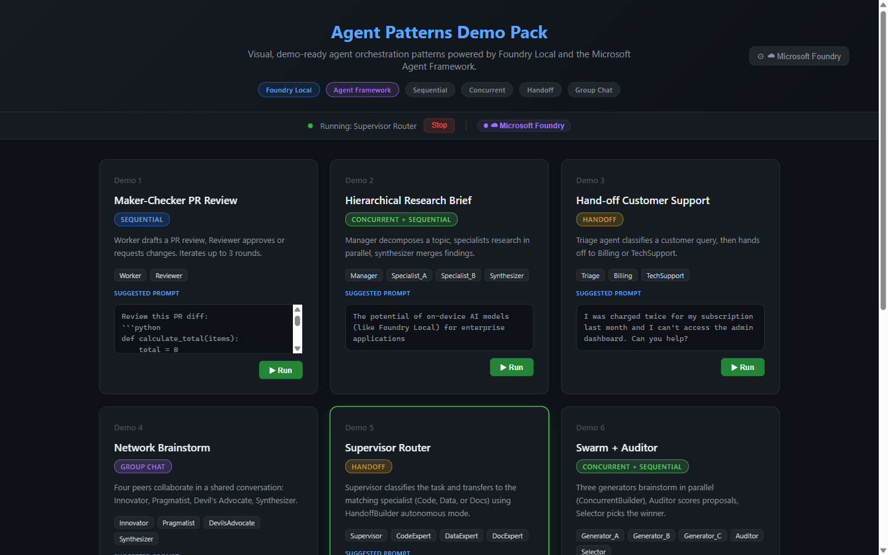 |  |

### Model Settings

| Foundry Local | Microsoft Foundry (Cloud) |
|---------------|---------------------------|
| 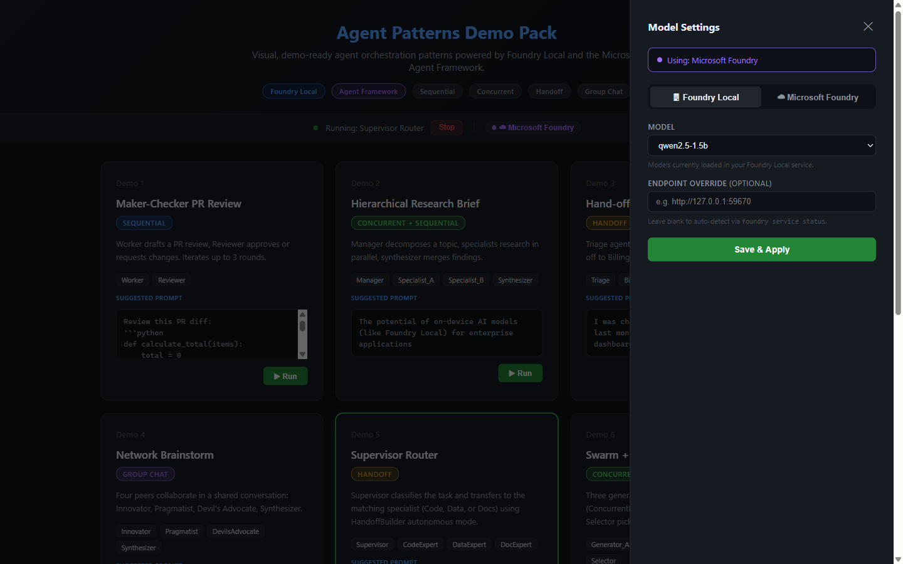 | 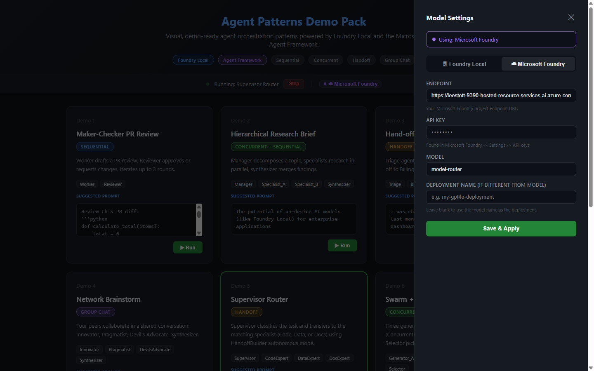 |

### Completed Demo Outcomes

| Demo 1: Maker-Checker | Demo 2: Hierarchical Research |
|------------------------|--------------------------------|
| 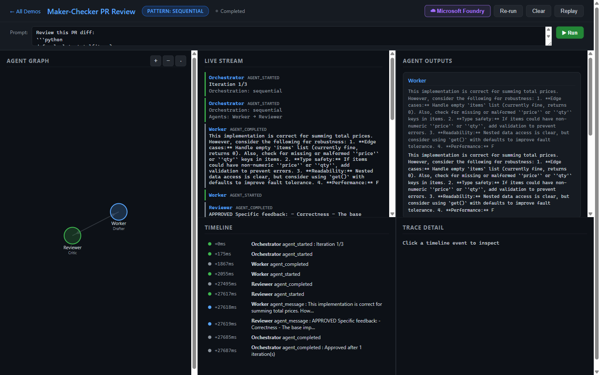 | 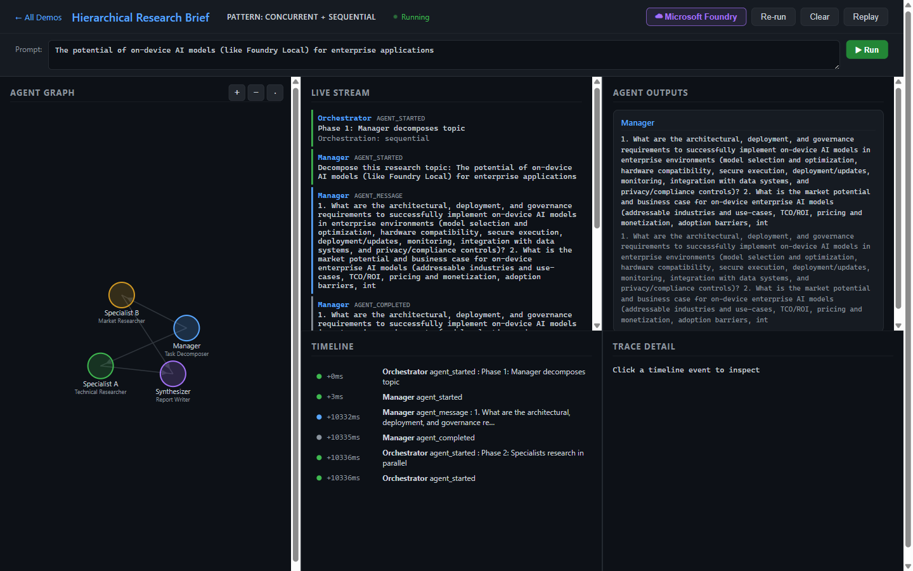 |

| Demo 3: Hand-off Support | Demo 4: Network Brainstorm |
|--------------------------|----------------------------|
| 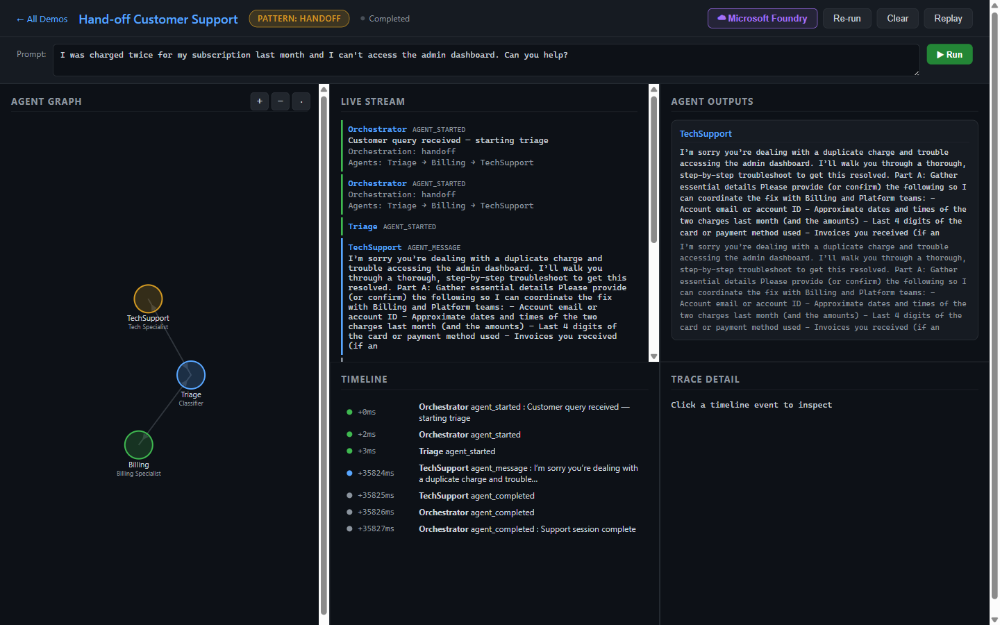 | 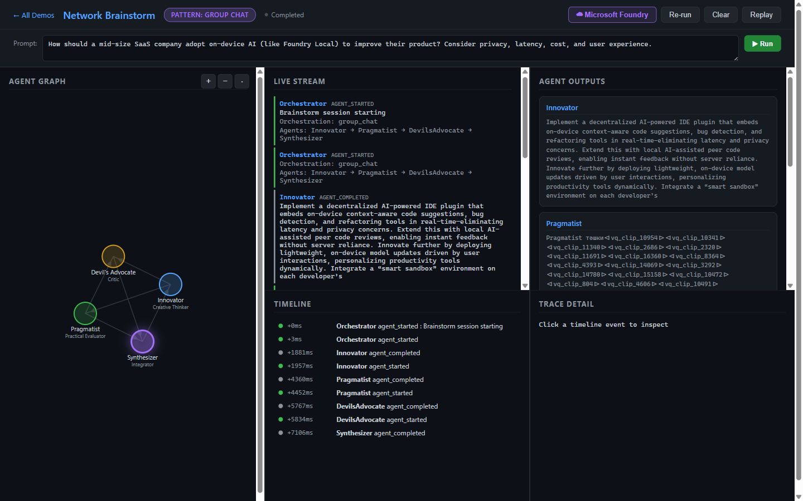 |

| Demo 5: Supervisor Router | Demo 6: Swarm + Auditor |
|---------------------------|-------------------------|
| 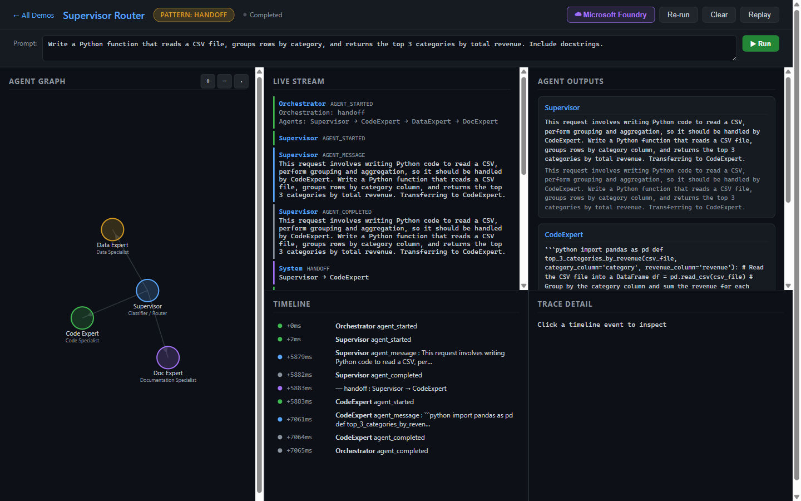 | 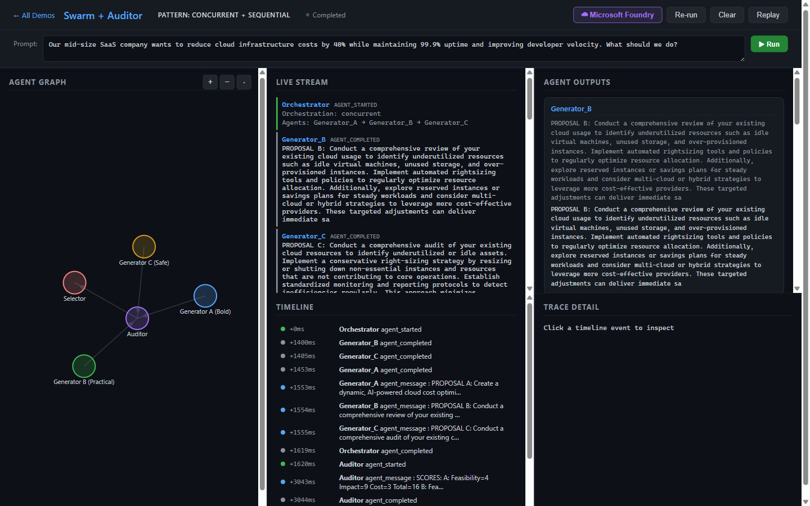 |

| Demo 7: Magentic One Assessment | |
|----------------------------------|--|
| 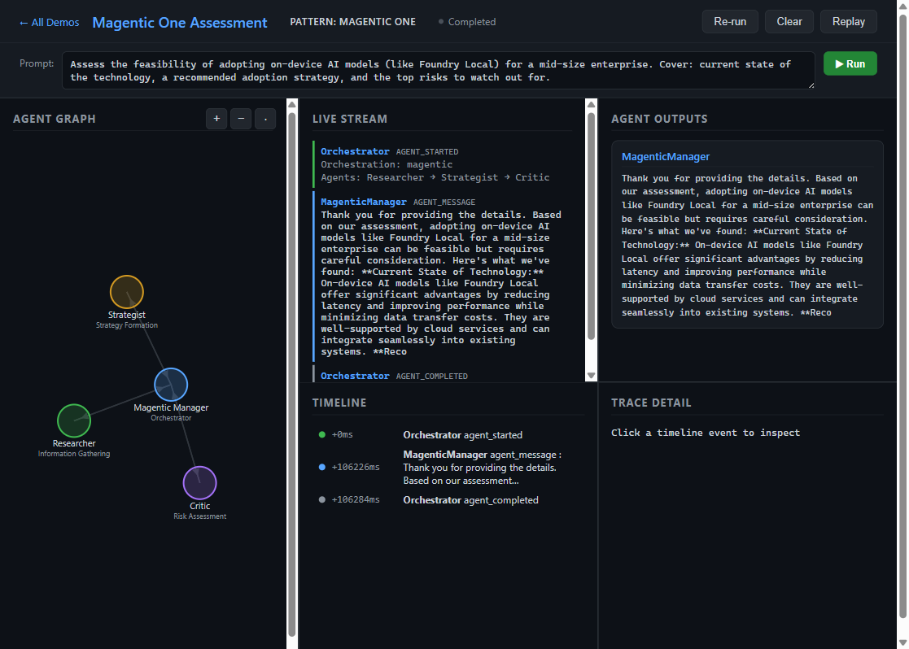 | |

### Live Status

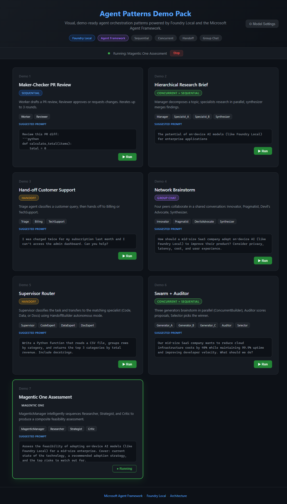

Regenerate screenshots and a walkthrough video with:

```bash
python capture_screenshots.py --video
# Outputs to screenshots/ and screenshots/video/demo_walkthrough.mp4
```

---

## License

MIT

> **Note**: This project is designed for local development and demos. The web server has no authentication and should only be run on localhost. See [SECURITY.md](SECURITY.md) for details.
